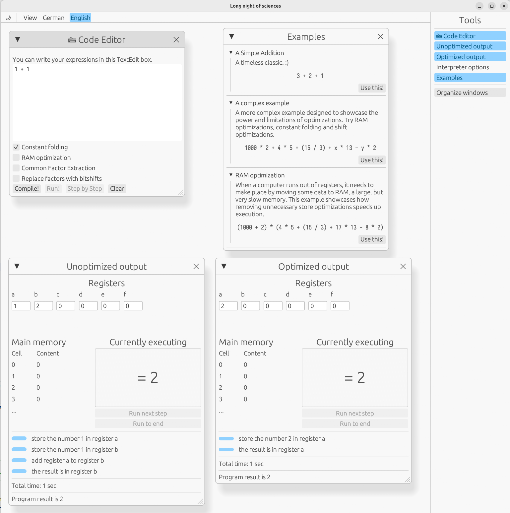

# Lange Nacht der Wissenschaften compiler demo
This project is a demonstration application for showing how a compiler works on a high level, and how compilers use optimizations to reduce runtime, number of operations, memory usage, etc.
Although it has been created for the Lange Nacht der Wissenschaften (long night of sciences), it can be used for any demonstration purpose, of course.

## Usage
To run the app, clone the repository and run `cargo run` (`--release`) in its root directory. This requires a nightly/>=1.88 Rust installation.

The app looks something like this and is mostly self-explanatory:

